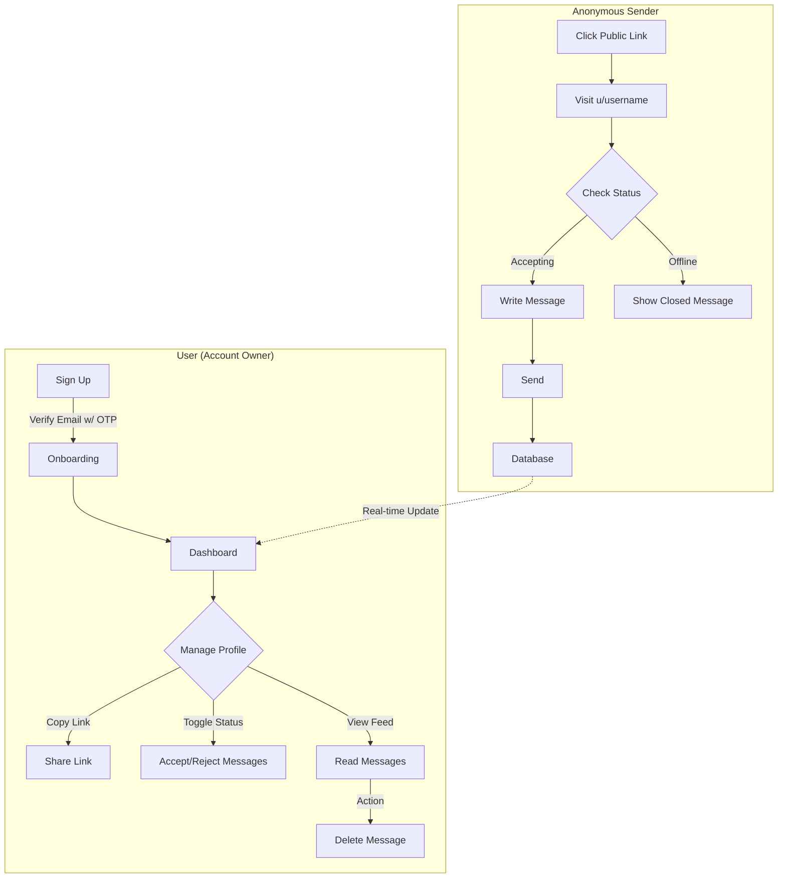

# Vox: Anonymous Messaging Platform

**Vox** is a privacy-focused, real-time anonymous messaging application. Users can create a profile, share their unique link, and receive honest, anonymous feedback or questions from others. It features a sleek, dark-themed dashboard tailored for a premium user experience.

<div align="center">
  
  
  
  
</div>

## Overview

**True honesty is rare when faces are visible.** In professional and personal growth, getting unfiltered feedback is often the hardest challenge. People hesitate to speak their minds due to social pressure or fear of conflict.

**Vox bridges this gap.** It creates a secure channel where identity is decoupled from content. You provide the platform, and your network provides the truth. Whether for constructive criticism, anonymous questions, or heartfelt confessions, Vox ensures the message determines the value, not the messenger.

You simply claim your unique corner of the web, share your link, and watch as your dashboard fills with insights you might never hear otherwise—all managed through a powerful, real-time interface that puts you in complete control.

## Core Features

Vox is built to make the experience of receiving feedback not just useful, but effortless and visually stunning. This isn't just a form; it's a dedicated inbox for the anonymous web.

| Feature                        | Description                                                                                                                                             |
| :----------------------------- | :------------------------------------------------------------------------------------------------------------------------------------------------------ |
| **Frictionless Anonymity**     | No sign-up required for senders. We remove every barrier between your audience's thought and your inbox.                                                |
| **Real-Time Feed**             | **Watch the conversation unfold.** Your dashboard updates instantly as messages arrive, no refreshing needed.                                           |
| **Smart Availability Control** | You are in charge. Instantly toggle **"Accepting Messages"** on or off. When off, your public page politely informs visitors you are offline.           |
| **Immersive "TypeShit" UI**    | Gone are boring admin panels. Vox features a **premium, dark-mode aesthetic**, enhanced with WebGL liquid shaders, magnetic buttons, and glassmorphism. |
| **AI-Ready Architecture**      | Built on a modular schema that supports future integration of AI moderation and sentiment analysis.                                                     |
| **Secure Authentication**      | Enterprise-grade protection using **NextAuth.js** with robust OTP verification, ensuring only _you_ see your messages.                                  |
| **Seamless Device Sync**       | Whether on a desktop command center or a mobile screen, the responsive design ensures pixel-perfect management anywhere.                                |

## The Flow

The application follows a secure and straightforward workflow for both account owners and anonymous senders.



## Tech Stack

- **Framework**: Next.js 15 (App Router)
- **Language**: TypeScript
- **Styling**: Tailwind CSS v4, Framer Motion, Shaders
- **UI Components**: Shadcn/ui (Radix Primitives)
- **Database**: MongoDB (Mongoose ORM)
- **Authentication**: NextAuth.js v4
- **Emails**: Resend & React Email

## Getting Started

Follow these steps to get Vox running on your local machine.

### Prerequisites

- Node.js (v18 or later)
- MongoDB URI

### 1. Clone the Repository

```bash
git clone https://github.com/yourusername/vox.git
cd vox
```

### 2. Install Dependencies

```bash
npm install
```

### 3. Environment Variables

Create a `.env` file in the root directory and add the following:

```env
MONGODB_URI="your_mongodb_connection_string"
NEXTAUTH_SECRET="your_nextauth_secret"
RESEND_API_KEY="your_resend_api_key"
NEXTAUTH_URL="http://localhost:3000"
```

### 4. Run Development Server

```bash
npm run dev
```

Open [http://localhost:3000](http://localhost:3000) in your browser.

## Contributing

Contributions are welcome! Please open an issue or submit a pull request.

## License

This project is licensed under the MIT License.
